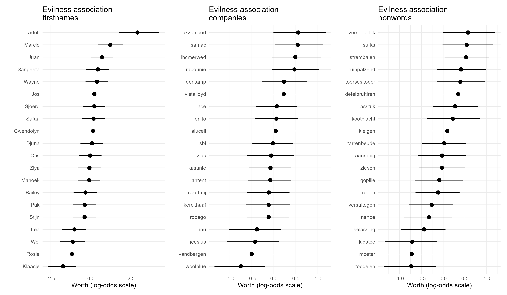

# Bayesian analysis of best-worst word association data
Preprocessing and analysis scripts for Bayesian analysis of best-worst scaling data, such as that generated by our [`word_norms_survey`](https://github.com/sodascience/word_norms_survey). The model in this repository allows for regression on the latent log-odds scale for the item values, which can answer questions such as:

> _Which properties of my words influence their association with evilness as measured by repeated best-worst rankings?_

> _How well does my language model predict word associations on femininity as measured by repeated best-worst rankings?_

## Installation
This repository uses an RStudio project. Open the [`bestworst_analysis.Rproj`](bestworst_analysis.Rproj) file in RStudio to open the project. To run the code in this repository, first install the dependencies as follows in `R`

```r
# install packages
pks <- c("cmdstanr", "tidyverse", "patchwork", "arrow")
install.packages(pks, repos = c("https://mc-stan.org/r-packages/", getOption("repos")))

# install stan to compile & run models
cmdstanr::install_cmdstan()
```

## Model
The model is a Bayesian rank-ordered logit (ROL) model which estimates latent item values based on (partial) rankings of these items on a specific task. The model is implemented in [`stan`](https://mc-stan.org). The stan code, data preparation functions, and posterior summarization functions can be found in the [`stan/`](./stan/) subfolder.

In these models, the likelihood of observing a rank ordering $y$ of $N$ items given each item's latent "worth" parameter $\theta_n$ is:

$$ P(y | \theta) = \sum^N_{n=1}\left[ \exp \theta_n \div \sum^N_{m = n} \exp \theta_m \right] $$

To learn more about these types of rank-ordered logit models, read:
- For an intuitive understanding, the introduction from the [Plackett-Luce package](https://hturner.github.io/PlackettLuce/)
  > Turner, H.L., van Etten, J., Firth, D. and Kosmidis, I. (2020). Modelling Rankings in R: The PlackettLuce Package Computational Statistics, 35, 1027-1057. URL https://doi.org/10.1007/s00180-020-00959-3.
- For how this maps to best-worst experiments, Case 1 & the section on Models of Ranking by Repeated Best and/or Worst Choice from [Marley, Flynn, & Australia (2015)](https://www.sciencedirect.com/science/article/pii/B9780080970868431223)
  > Marley, A. A., Flynn, T. N., & Australia, V. (2015). Best worst scaling: theory and practice. International encyclopedia of the social & behavioral sciences, 2(2), 548-552.
- For the stochastic (Bayesian) implementation: [Glickman & Hennessy (2015)](https://www.degruyter.com/document/doi/10.1515/jqas-2015-0012/html)
  > Glickman, M. E., & Hennessy, J. (2015). A stochastic rank ordered logit model for rating multi-competitor games and sports. Journal of Quantitative Analysis in Sports, 11(3), 131-144.

## Scripts
### Experiment data processing
The experiment data processing script ([`01_experiment_process.R`](01_experiment_process.R)) takes in data from a best-worst scaling experiment ([`data_raw/experiment_data/`](./data_raw/experiment_data/)) and creates a long-format version of this data which contains the following information:

- __subj_id__ the (anonymous) identifier of the participant in the study
- __trial__ the trial number of the participant
- __association__ the association that was tested (e.g., evilness, femininity)
- __wordtype__ the type of the words in the trial (first names, company names, non-words)
- __option__ the option number of the words (1 to 4)
- __word__ the word belonging to this option in the trial
- __ranking__ how the word was ranked. 1 is best, 4 is worst, and the remaining (unranked) words are given an equal middle rank (2.5).

In addition, the following inclusion criteria are applied: 

- include only participants who fully passed the attention check (i.e., both best and worst answers correct)
- remove trials with response time <= 3 seconds
- remove trials with log-response time >= 4 sd (i.e., approx 27 seconds)

This reduces the total number of trials from 12341 to 10266.

This long-format data is then stored as an `rds` file in the processed data folder.

### Word data preprocessing
The word data processing script [`02_word_preprocess.R`](02_word_preprocess.R) reads the word data from [`data_raw/word_data/`](./data_raw/word_data/) and stores it as processed data (an `rds` file) in the processed data folder.

> NB: for testing, the word data preprocessing script also adds a random item-level predictor to this data: `languagemodel_prediction_evilness`

### Estimating item-level associations
The first analysis script [`03_estimate_log_worth.R`](03_estimate_log_worth.R) estimates log-worths for each word in a single word-type category on a single association. It produces the following plot of latent worth on a log-odds scale:




### Predicting item-level associations using item-level predictors
The second analysis script [`04_regress_log_worth.R`](04_regress_log_worth.R) performs regression for the log-worths using item-level predictors from the word data. Using this approach, it is possible to perform inference for the regression parameters:

```
# A tibble: 1 × 10
  variable                           mean median    sd   mad     q5   q95  rhat ess_bulk ess_tail
  <chr>                             <dbl>  <dbl> <dbl> <dbl>  <dbl> <dbl> <dbl>    <dbl>    <dbl>
1 languagemodel_prediction_evilness 0.142  0.144 0.272 0.257 -0.301 0.587  1.00    3201.    4100.
```

## Contributing

Contributions are what make the open source community an amazing place to learn, inspire, and create.

Any contributions you make are greatly appreciated.

To contribute:
1. Fork the Project
2. Create your Feature Branch (`git checkout -b feature/AmazingFeature`)
3. Commit your Changes (`git commit -m 'Add some AmazingFeature'`)
4. Push to the Branch (`git push origin feature/AmazingFeature`)
5. Open a Pull Request

## Contact


This project is developed and maintained by the [ODISSEI Social Data
Science (SoDa)](https://odissei-soda.nl) team.

Do you have questions, suggestions, or remarks? File an issue in the
issue tracker or feel free to contact the team at [`odissei-soda.nl`](https://odissei-soda.nl)

